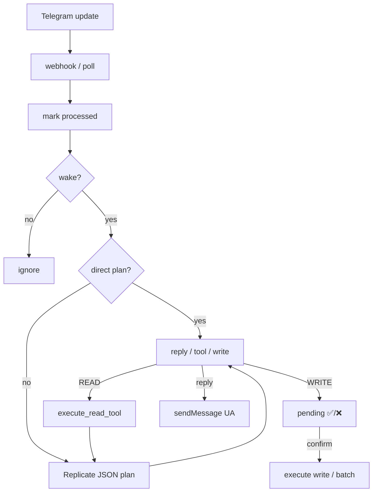

# Telegram-бот і AI-агент (mr.Carpet)

Коротка пам’ятка: як працюють сповіщення, webhook і LLM-оператор у групі команди.

> Копія також у локальній (gitignored) `docs/TELEGRAM_AI.md`. Цей README — у git.

## Два шари

| Шар | Навіщо | Код |
|-----|--------|-----|
| **Notify** | Сайт → Telegram: нове замовлення, контакт, «немає в наявності» | `project/telegram_utils.py` |
| **AI agent** | Менеджери в групі питають бота / просять змінити статус, склад, лист | `project/telegram_agent/` |

Налаштування (singleton): Admin → **Telegram settings** (`TelegramSettings`).

Важливі прапорці:

- `is_enabled` + `bot_token` + `chat_id` — notify
- `ai_enabled` + те саме + `REPLICATE_API_TOKEN` → `ai_ready` — агент
- `message_thread_id` — forum topic (напр. «mr.Carpet orders»)
- `webhook_secret` — обов’язковий, якщо AI увімкнено (інакше webhook → 403)
- `replicate_model` — за замовчуванням `meta/llama-4-scout-instruct` (золота середина: розумніше за 8B, дешевше за 70B)
- `wake_words` — типово «містер карпет»
- `ai_rate_limit_per_user` — ліміт user-повідомлень / 10 хв

## Ingress

**Prod:** `POST /api/telegram/webhook/`  
Header від Telegram: `X-Telegram-Bot-Api-Secret-Token` (= `webhook_secret`).

```bash
python manage.py telegram_set_webhook --generate-secret
# або з готовим URL
```

**Local:** `python manage.py telegram_poll` (long polling; webhook на проді має бути знятий).

Інше:

- `telegram_ai_test` — сухий прогін плану
- `telegram_memory_stats` — розмір пам’яті
- `send_telegram_test` — тестове notify

Group Privacy у BotFather: **OFF**, інакше бот не бачить звичайні повідомлення в групі.

## Як агент відповідає (pipeline)

```
update
  → dedupe (TelegramProcessedUpdate); при fail AI — unmark (можна ретрай)
  → chat_allowed (chat_id + thread)
  → should_wake: wake-слово | @mention | reply на повідомлення бота
  → rate limit
  → typing (sendChatAction)
  → memory: append user
  → maybe_direct_plan (regex, без LLM) АБО plan_once (Replicate JSON)
  → reply | READ tools (+ re-plan) | WRITE → pending ✅/❌
```

Файли:

- `triggers.py` — wake / chat gate  
- `intent.py` — дешевий роутер (статуси UA, склад, пошук по телефону, статус+лист)  
- `llm.py` — system prompt + Replicate, лише JSON-план  
- `tools.py` — allowlist READ/WRITE, без ORM у промпті  
- `pending.py` — HITL, batch write, `select_for_update`  
- `memory.py` — вікно 12 / DB 40 / summary кожні 20 / TTL 7 днів  
- `handler.py` — оркестрація  

### Плани LLM (строго JSON)

```json
{"type":"reply","text":"..."}
{"type":"tool","name":"get_order","args":{"order_number":123}}
{"type":"write","name":"set_order_status","args":{...}}
{"type":"tools","calls":[{"name":"...","args":{...}}]}
```

WRITE ніколи не виконується одразу — лише після ✅ у чаті (будь-хто з групи; by design для «сімейної» групи).

Кілька write (статус + лист) → один pending `batch`. Якщо SMTP впав — статус у БД може вже змінитись, у чаті буде **«Не повністю»**, не фейковий ✅.

### READ tools

`count_orders`, `list_recent_orders`, `get_order`, `find_orders` (телефон / ім’я / місто), `count_products`, `count_in_stock_products`, `get_product_stock`

### WRITE tools

`set_order_status`, `send_order_email`, `change_stock_quantity`

Статуси замовлення: коди EN у БД, людям — українські лейбли (`status_labels.py` / `Order.STATUS_CHOICES`).

## Пам’ять і номер замовлення

- Репліки user/assistant/tool → `TelegramChatMessage`
- Summary → `TelegramChatMemory`
- Outbound **notify замовлення** також пишеться в memory (plain), щоб потім «покажи деталі» / «зміни статус» бачили № без повторного копіювання
- Intent додатково бере № з reply-to + HISTORY + summary

## Типові фрази менеджера

- `містер карпет, які є статуси?`
- `знайди замовлення по телефону 0501234567`
- `замовлення що очікують оплати`
- reply на нотифікацію: `зміни на статус completed і напиши клієнту листа` → один ✅ на обидві дії
- `… розмір 0.8х1.5 постав 5` / `+2` — склад

## Безпека (коротко)

1. Webhook secret обов’язковий при `ai_ready`  
2. Тільки налаштований `chat_id` (+ thread)  
3. LLM не має прямого ORM — лише tools  
4. Write = HITL  
5. Rate limit на `tg_user_id`  

Не зроблено (свідомо): підтвердження лише автором запиту — у сімейній групі зручніше «будь-хто».

## Реплікейт / сцена / SEO (не плутати)

Той самий `REPLICATE_API_TOKEN` використовується ще для:

- SEO-текстів (`catalog/services/seo_generate.py`)
- генерації фото товару / інтер’єру (`catalog/services/replicate_*.py`, admin JS)

Telegram-агент — окремий пакет і окремий system prompt.

## Дебаг чеклист

1. Admin: `ai_enabled`, `is_enabled`, token, chat, thread, secret  
2. `REPLICATE_API_TOKEN` у env контейнера  
3. Webhook URL + secret (`getWebhookInfo` у Bot API)  
4. Privacy OFF  
5. Логи web: `agent process failed` / `telegram webhook`  
6. Тести: `python manage.py test project.tests.test_telegram_intent`

## Швидка схема


